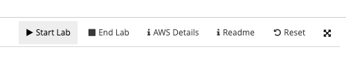
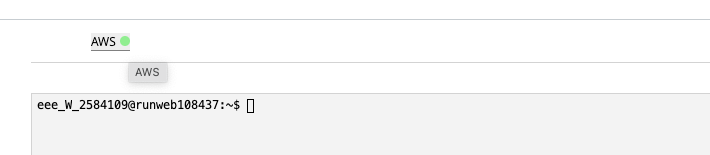
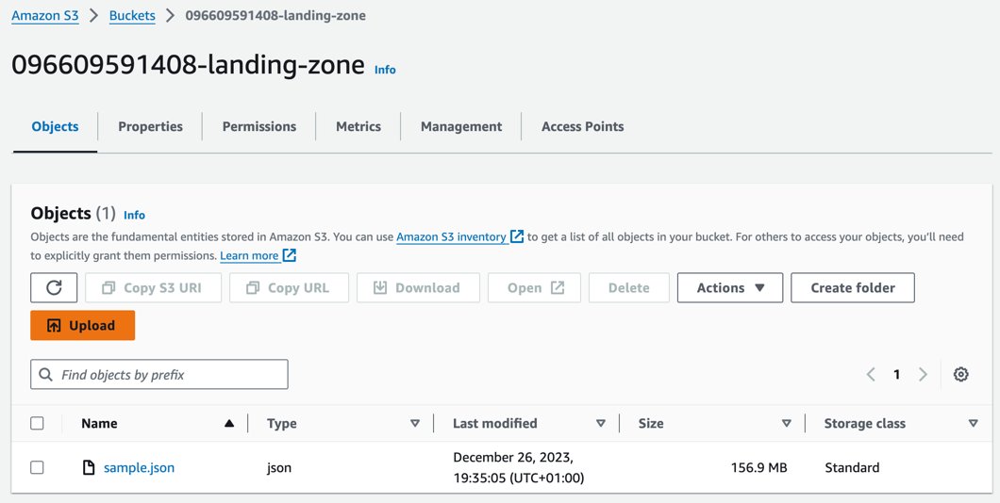
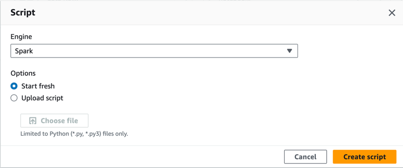
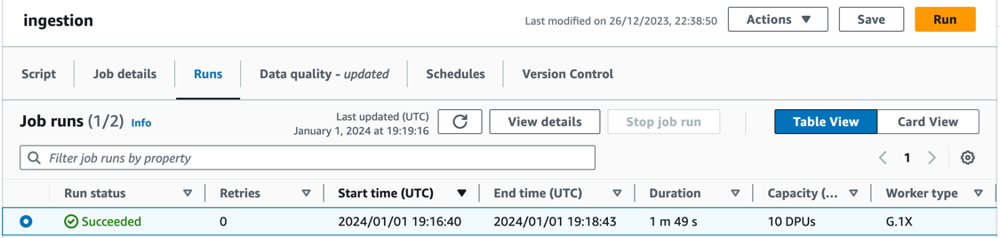
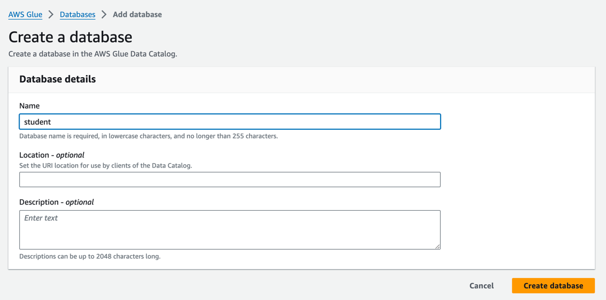
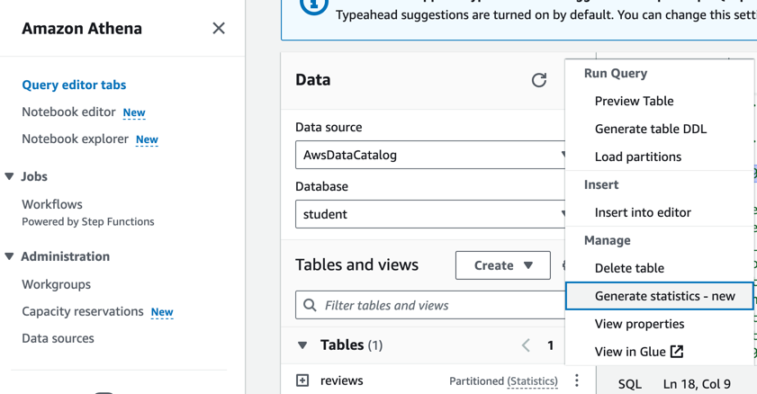
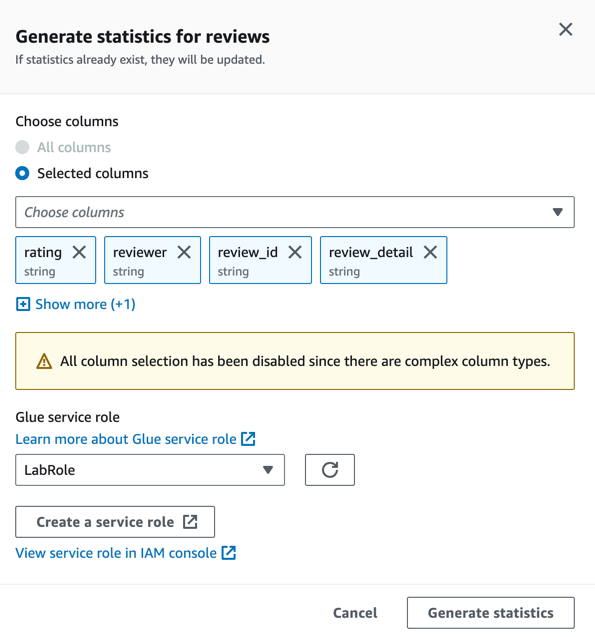
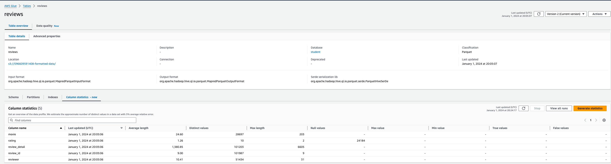

## Przygotowanie danych źródłowych

### Przygotowanie środowiska

1. Zaloguj się do AWS Academy
2. Uruchom szkolenie `AWS Academy Learner Lab`
3. Wejdź do modułu `Launch AWS Academy Learner Lab`
4. Kliknij przycisk `Start Lab`. 

   

5. Uruchom konsolę AWS kiedy pojawi się zielona kropka

   
   ```
   Sesja konsoli AWS trwa 3h. Żeby zapewnic ciągłośc sesji bez ponownego uruchamiania konsoli należy kliknąc "Start Lab" ponownie zanim sesja wygaśnie.
   ``` 

### Architektura do zaimplementowania

```puml
@startuml
!pragma layout smetana
!theme aws-orange

!define AWSPuml https://raw.githubusercontent.com/awslabs/aws-icons-for-plantuml/v17.0/dist

!include AWSPuml/AWSCommon.puml
!include AWSPuml/AWSC4Integration.puml
!include AWSPuml/AWSSimplified.puml
!include AWSPuml/AWSRaw.puml
!include AWSPuml/ApplicationIntegration/all.puml
!include AWSPuml/Compute/all.puml
!include AWSPuml/Containers/all.puml
!include AWSPuml/Database/all.puml
!include AWSPuml/General/all.puml
!include AWSPuml/Analytics/all.puml
!include AWSPuml/Storage/all.puml

SimpleStorageService(LandingZone, "Surowe dane", " ") #White
Glue(ETL, "Aplikacja PySpark", " ") #White
SimpleStorageService(FormattedData, "Sformatowane dane", " ") #White
GlueDataCatalog(DataCatalog, "Katalog AWS Glue", " ") #White
Athena(Athena, "Athena", " ") #White

LandingZone -> ETL: odczyt surowych danych
ETL-> FormattedData: zapis do formatu parquet
FormattedData -> DataCatalog: utworzenie bazy danych
DataCatalog <-> Athena: utworzenie tabeli,\n odczyt partycji

@enduml
```

### Przygotowanie danych źródłowych

1. Pobierz lokalnie plik `sample.json` ze zbioru danych [IMDb Review Dataset](https://www.kaggle.com/datasets/ebiswas/imdb-review-dataset/data) udostępnionych na platformie Kaggle.

   ```
   Zbiór zawiera 5.5M recenzji filmów. Zbiór jest podzielony na kilka części i zawiera również plik `sample.json, który posłuży do zbudowania rozwiązania zanim procesowanie zostanie wykonane na pełnym zbiorze.
   ```

2. Utwórz S3 bucket z konsoli AWS. 
   ```
   Uruchom skrypt poniżej przez `CloudShell` lub utwórz z poziomu serwisu `Amazon S3/Buckets`
   ```

   ```shell
   aws s3api create-bucket --bucket ${ACCOUNT_ID}-landing-zone --region us-east-1
   ```

3. Prześlij surowe dane (plik sample.json) do nowo utworzonej ścieżki.

   

### Konwersja danych do Parquet 

1. Utwórz S3 bucket dla danych wyjściowych.
   ```
   Uruchom skrypt poniżej przez `CloudShell` lub utwórz z poziomu serwisu `Amazon S3/Buckets`
   ```
   
   ```shell
   aws s3api create-bucket --bucket ${ACCOUNT_ID}-formatted-data --region us-east-1
   ```

2. Z serwisu `AWS Glue` uruchom zakładkę `ETL Jobs/Notebooks`
3. Utwórz nowy skrypt

   * Engine: Spark
   * Options: Start fresh

   

3. Zaimplementuj proces ETL z wykorzystaniem PySpark

* utwórz kontekst aplikacji PySpark
* odczytaj dane w formacie `json` z odpowiedniej lokalizacji `S3` do obiektu `DataFrame`
* zapisz dane do formatu `parquet` gdzie kluczem partycji będzie kolumna `review_date`

   ```python
   # Przykładowa implementacja
   import sys
   from awsglue.transforms import *
   from awsglue.utils import getResolvedOptions
   from pyspark.context import SparkContext
   from awsglue.context import GlueContext
   from awsglue.dynamicframe import DynamicFrame
   from awsglue.job import Job
   
   args = getResolvedOptions(sys.argv, ["JOB_NAME"])
   sc = SparkContext()
   glueContext = GlueContext(sc)
   spark = glueContext.spark_session
   job = Job(glueContext)
   job.init(args["JOB_NAME"], args)
   
   dataFrame = spark.read.json("s3://637765332182-landing-zone/sample.json")
   
   dynamicFrame = DynamicFrame.fromDF(dataFrame, glueContext, "")
   
   
   glueContext.write_dynamic_frame.from_options(
       frame=dynamicFrame,
       connection_type='s3',
       connection_options={
           'path': "s3://637765332182-formatted-data", "partitionKeys": ["review_date"]
       },
       format='parquet',
   )
   
   job.commit()
   ```

4. Uruchom skrypt

   ```
   W zakładce `Runs` widoczny będzie nowy proces w statusie `Running`. Po kilku minutach status powinien zmienic się na `Succeeded` 
   ```

   

### Analiza jakości danych wejściowych

1. Z serwisu `AWS Glue` uruchom zakładkę `Data Catalog/Tables`
2. Utwórz bazę danych o nazwie `student`

   

3. Z serwisu `Athena` uruchom zakładkę `Query editor tabs`
4. Utwórz tabele na podstawie danych z S3

   * Data source: AwsDataCatalog
   * Database: student
   * Skrypt do utworzenia tabeli:
   ```sql
     CREATE EXTERNAL TABLE `reviews`(
     `helpful` array<string>,
     `movie` string,
     `rating` string,
     `review_detail` string,
     `review_id` string,
     `review_summary` string,
     `reviewer` string,
     `spoiler_tag` bigint)
     PARTITIONED BY (review_date string)
     ROW FORMAT SERDE
     'org.apache.hadoop.hive.ql.io.parquet.serde.ParquetHiveSerDe'
     STORED AS INPUTFORMAT
     'org.apache.hadoop.hive.ql.io.parquet.MapredParquetInputFormat'
     OUTPUTFORMAT
     'org.apache.hadoop.hive.ql.io.parquet.MapredParquetOutputFormat'
     LOCATION
     's3://${ACCOUNT_ID}-formatted-data/'
     TBLPROPERTIES (
     'CrawlerSchemaDeserializerVersion'='1.0',
     'CrawlerSchemaSerializerVersion'='1.0',
     'UPDATED_BY_CRAWLER'='review_crawler',
     'averageRecordSize'='1459',
     'classification'='parquet',
     'compressionType'='none',
     'objectCount'='1',
     'recordCount'='100000',
     'sizeKey'='94807077',
     'typeOfData'='file')
   ```
5. Zaimportuj dane z wszystkich partycji
   * Skrypt:
   ```sql
    MSCK REPAIR TABLE `reviews`;
   ```
   
6. Analiza jakości danych
   * Wygeneruj statystyki dla tabeli `reviews`
   
   
   
   * Wybierz kolumny do wyliczenia statystyk
   
   
   
   * Wyświetl statystyki z serwisu `AWS Glue` w zakładce `Data Catalog/Databases/Tables`
   
   

### Przydatne linki


