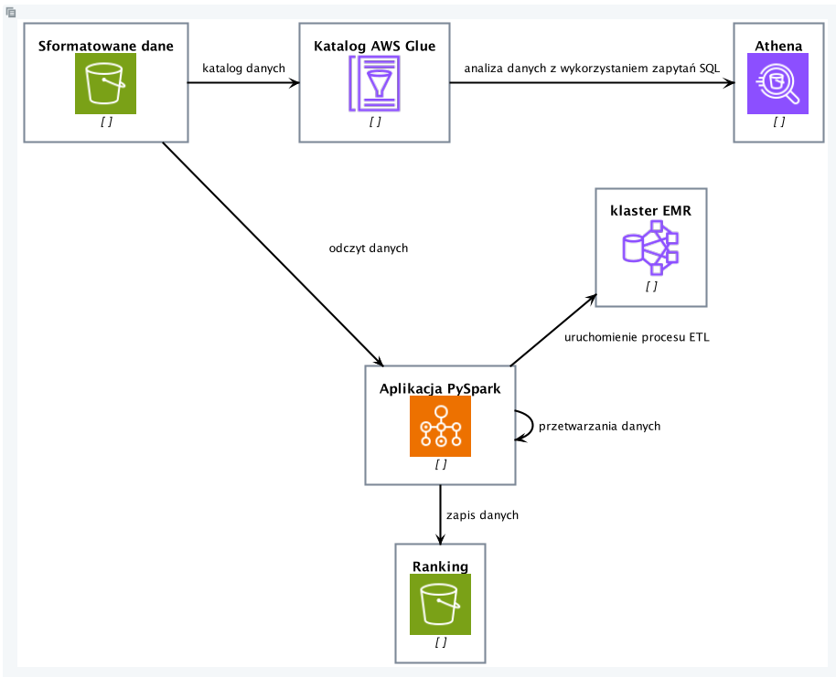
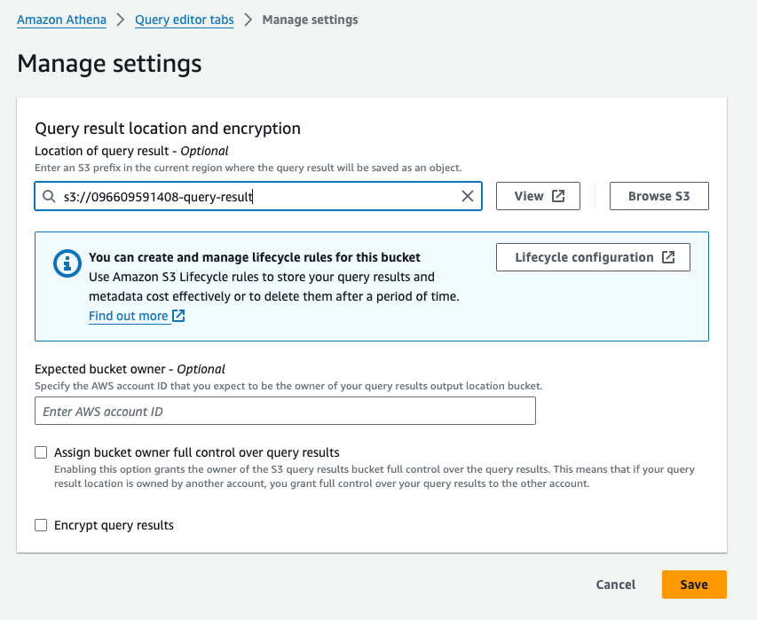
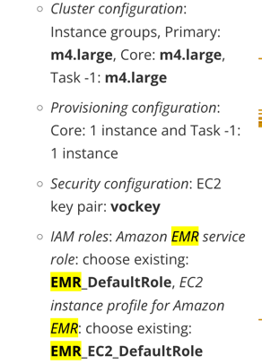
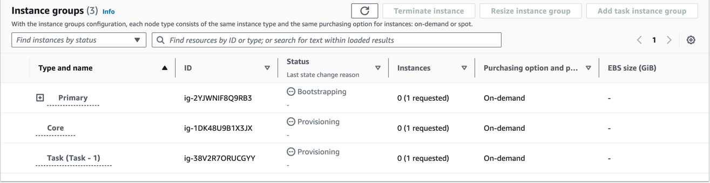
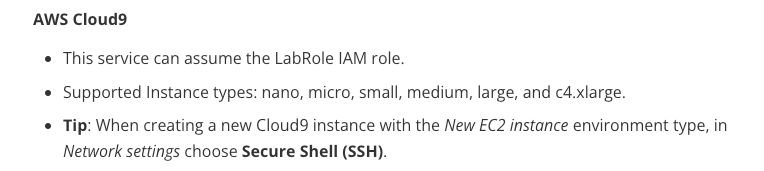
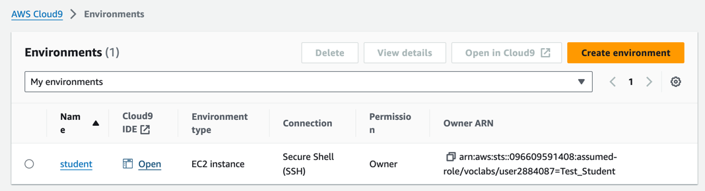
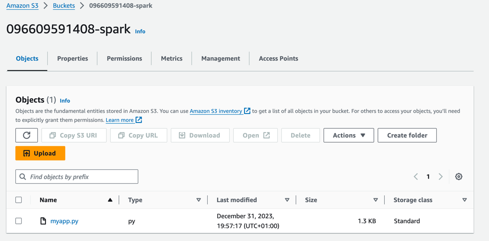
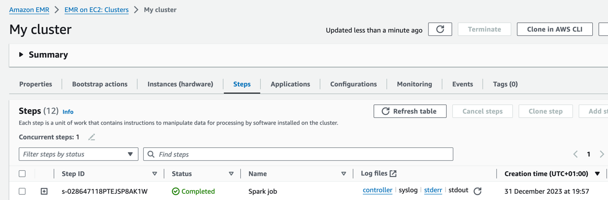
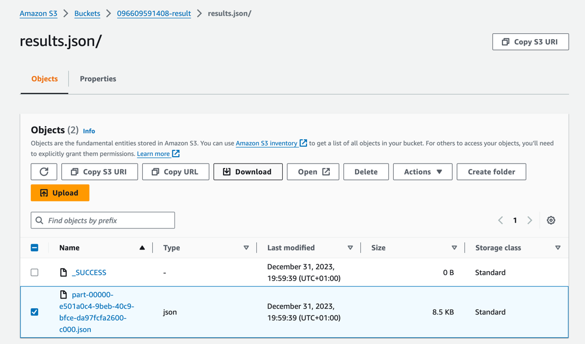

## Ranking najlepszych filmów

### Architektura do zaimplementowania



### Analiza danych z wykorzystaniem Amazon Athena

1. Utwórz S3 bucket do przechowywania wyników zapytań
   ```
   Uruchom skrypt poniżej przez `CloudShell` lub utwórz z poziomu serwisu `Amazon S3/Buckets`
   ```

   ```shell
   aws s3api create-bucket --bucket ${ACCOUNT_ID}-query-result --region us-east-1
   ```

2. Z serwisu `Athena` w zakładce `Query editor tabs/Settings` kliknij przycisk `Manage`

   

3. Z serwisu `Athena` w zakładce `Query editor tabs` wykonaj poniższe zapytania

    * Wyświetl 10 pierwszych recenzji
    ```sql
    SELECT * FROM "student"."reviews" limit 10;
    ```
    * Wyświetl ranking filmów
    ```sql
    SELECT movie, avg(cast(rating as double)) as avg_rating, regexp_extract(movie, '\(\d+\)') as movie_year FROM "student"."reviews"  group by regexp_extract(movie, '\(\d+\)'), movie order by movie_year desc, avg_rating desc;
    ```

## Konfiguracja klastra EMR

1. Z serwisu `EMR` w zakładce `EMR on EC2/Clusters` utwórz nowy klaster

   * Amazon EMR release: emr-6.15.0
   * Application bundle: Spark interactive (domyślne)
   * Pozostałe według zaleceń `Learner Lab`:
   
   

2. Z serwisu `EMR` w zakładce `EMR on EC2/Clusters` sprawdź status klastra

   * Wybierz identyfikator klastra, który właśnie został utworzony
   * W zakładce `Instances(hardware)` sprawdź status uruchomienia komponentów klastra
   
``   

## Konfiguracja Cloud9 Studio

1. Z serwisu `Cloud9` w zakładce `My environments` utwórz nowe środowisko

   * konfiguracja zgodnie z zaleceniami `Learner Lab`:
   
   
   
2. Otwórz środowisko `Cloud9 IDE`

   


### Implementacja procesu ETL do wygenerowania rankingu filmów

```
Celem procesu ETL jest wygenerowanie rankingu najlepszych filmów na każdy rok i posortowanie ich w kolejności od najnowszych
```

1. W środowisku `Cloud9 IDE` utwórz nowy plik `myapp.py`

2. Zaimplementuj proces ETL z wykorzystaniem PySpark

   ```python
   from pyspark.sql import SparkSession
   from pyspark.sql.functions import regexp_extract, desc, avg, row_number, col, count
   from pyspark.sql.window import Window
   
   def main():
       with SparkSession.builder.appName("MyApp").getOrCreate() as spark:
           df = spark.read.parquet("s3://096609591408-formatted-data")
   
           # preprocessing
           df = df.filter(df.rating.isNotNull())
   
           movies_with_avg_rating = df.groupBy(df.movie).agg(avg(df.rating).alias("avg_rating"), count(df.movie).alias("num_of_reviews")).sort(
               desc("avg_rating"))
   
           movies_with_avg_rating = movies_with_avg_rating.filter(movies_with_avg_rating.num_of_reviews > 5)
           movies_with_avg_rating = movies_with_avg_rating.withColumn("movie_year", regexp_extract(movies_with_avg_rating.movie, "\(\d+\)", 0))
   
           movie_ranking_by_year_window = Window.partitionBy("movie_year").orderBy(col("avg_rating").desc())
           top_movies_for_each_year = movies_with_avg_rating.withColumn("row", row_number().over(movie_ranking_by_year_window)).filter(
               col("row") == 1).drop("row").orderBy(col("movie_year").desc())
   
           top_movies_for_each_year.limit(150).coalesce(1).write.json("s3://096609591408-result/results.json", mode='Overwrite')
   
   
   if __name__ == "__main__":
       main()
   ```

3. Utwórz S3 bucket do przechowywania aplikacji PySpark
   ```
   Uruchom skrypt poniżej przez `CloudShell` lub utwórz z poziomu serwisu `Amazon S3/Buckets`
   ```

   ```shell
   aws s3api create-bucket --bucket ${ACCOUNT_ID}-result --region us-east-1
   ```
4. Utwórz S3 bucket do przechowywania skryptów aplikacji PySpark
   ```
   Uruchom skrypt poniżej przez `CloudShell` lub utwórz z poziomu serwisu `Amazon S3/Buckets`
   ```

   ```shell
   aws s3api create-bucket --bucket ${ACCOUNT_ID}-spark --region us-east-1
   ```  
5. Pobierz skrypt `myapp.py` lokalnie i prześlij do dedykowanej ścieżki na S3

   

6. Uruchom proces ETL

   * Uruchom skrypt z konsoli Cloud9:
   ```
   aws emr add-steps --cluster-id ${CLUSTER_ID} --steps Type=Spark,Name="Spark job",ActionOnFailure=CONTINUE,Args=[--deploy-mode,cluster,--master,yarn,s3://${ACCOUNT_ID}-spark/myapp.py]
   ```

   * Sprawdź status wykonania procesu ETL w serwisie `EMR` w zakładce `EMR on EC2/Clusters/Steps`
   
      

   * Pobierz wygenerowany ranking filmów z dedykowanej ścieżki na S3

   

### Przydatne linki

[Instalacja dodatkowych zależności dla klastra EMR](https://docs.aws.amazon.com/emr/latest/ManagementGuide/emr-plan-bootstrap.html)
