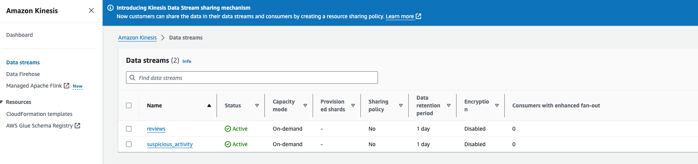
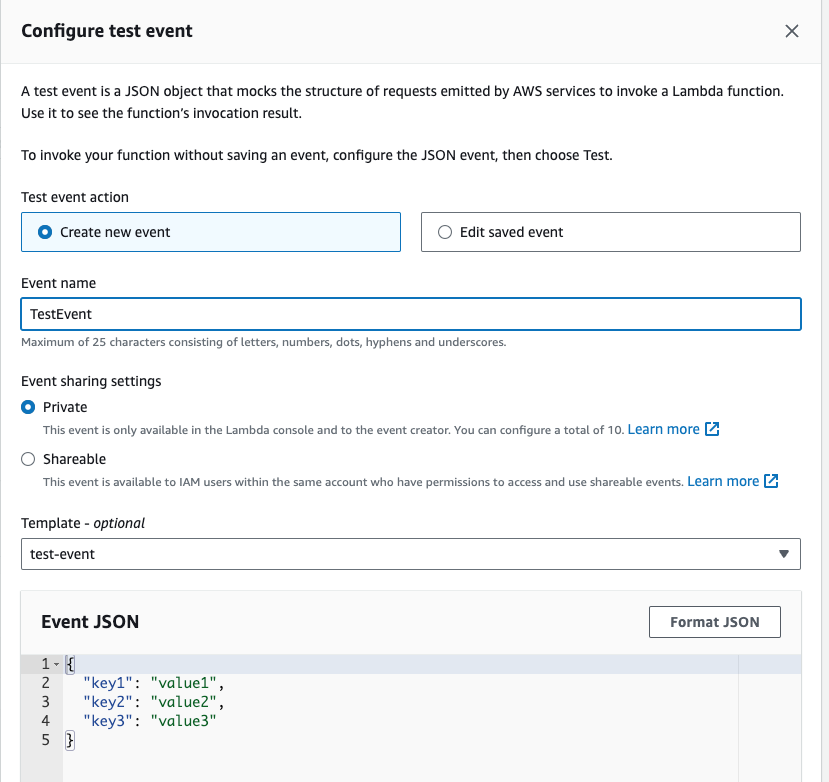
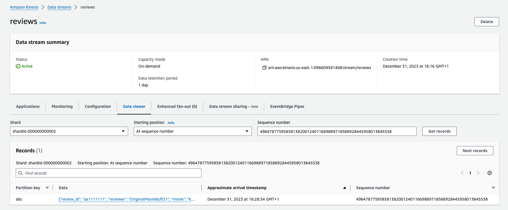
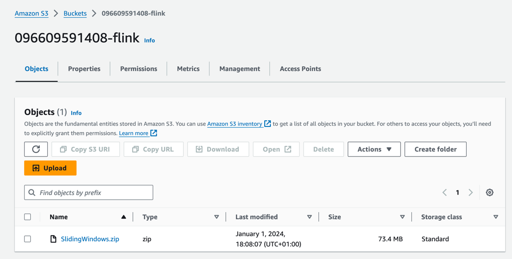
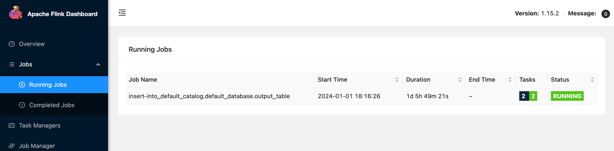
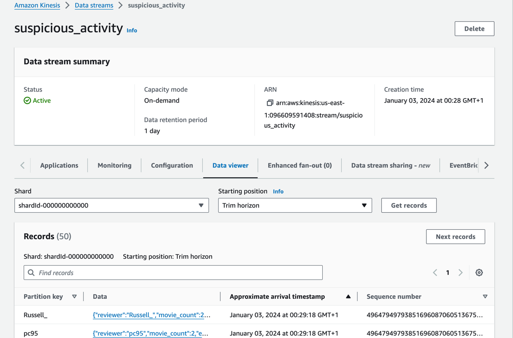

## Wykrywanie anomalii w czasie rzeczywistym

### Architektura do zaimplementowania

```puml
@startuml
!pragma layout smetana
!theme aws-orange

!define AWSPuml https://raw.githubusercontent.com/awslabs/aws-icons-for-plantuml/v17.0/dist

!include AWSPuml/AWSCommon.puml
!include AWSPuml/AWSC4Integration.puml
!include AWSPuml/AWSSimplified.puml
!include AWSPuml/AWSRaw.puml
!include AWSPuml/ApplicationIntegration/all.puml
!include AWSPuml/Compute/all.puml
!include AWSPuml/Containers/all.puml
!include AWSPuml/Database/all.puml
!include AWSPuml/General/all.puml
!include AWSPuml/Analytics/all.puml
!include AWSPuml/Storage/all.puml

SimpleStorageService(LandingZone, "Surowe dane", " ") #White
Lambda(Producer, "Generator komunikatów", " ") #White
KinesisDataStreams(InputStream, "Strumień recenzji", " ") #White
ManagedServiceforApacheFlink(StreamProcessor, "Procesowanie w czasie rzeczywistym", " ") #White
KinesisDataStreams(OutputStream, "Strumień podejrzanych użytkowników", " ") #White

LandingZone --> Producer: odczyt surowych danych
Producer --> InputStream: wygenerowanie komunikatu\n dla każdej odczytanej recenzji
InputStream --> StreamProcessor: wykrywanie podejrzanej aktywności
StreamProcessor --> OutputStream: zapisanie podejrzanej\n aktywności jako komunikat na kolejke

@enduml
```

### Konfiguracja środowiska do procesowania strumieniowego

1. Utwórz rozproszone kolejki danych

   * Z serwisu `Kinesis` w zakładce `Data streams` kliknij przycisk `Create data stream`
   * Utwórz dwie kolejki: `reviews` i `suspicious_activity`
   
   

### Implementacja generatora danych

1. Z serwisu `AWS Lambda` w zakładce `Functions` kliknij przycisk `Create function`
   * Option: Author from scratch
   * Function name: reviewProducer
   * Runtime: Python 3.12
   * Architecture: x86_64
2. Z serwisu `AWS Lambda` w zakładce `Functions` kliknij na nowo utworzoną funkcje `reviewProducer`
   * Zmień konfiguracje w zakładce `Configuration`
     * Memory 512 MB
     * Timeout 5min
   * W zakładce `Code` zastąp kod źródłowy w pliku `lambda_function.py` poniższym skryptem:

    ```python
    import boto3
    import json
    import datetime
    import logging
    
    
    logger = logging.getLogger()
    logger.setLevel("INFO")
    
    stream_name = 'reviews'
    bucket =  '096609591408-landing-zone'
    key = 'sample.json'
    
    s3_client = boto3.resource('s3')
    kinesis_client = boto3.client('kinesis', region_name='us-east-1')
    
    
    
    def lambda_handler(event, context):
        logger.info("Lambda invoked")
    
        obj = s3_client.Object(bucket, key)
        data = obj.get()['Body'].read().decode('utf-8')
        json_data = json.loads(data)
        for record in json_data:
            review_id = record["review_id"]
            reviewer = record["reviewer"]
            movie = record["movie"]
            rating = record["rating"]
            review_summary = record["review_summary"]
            review_date = record["review_date"]
            spoiler_tag = record["spoiler_tag"]
            review_detail = record["review_detail"]
            spoiler_tag = record["spoiler_tag"]
            helpful = record["helpful"]
    
            put_to_stream(review_id, reviewer, movie, rating, review_summary, review_date, spoiler_tag, review_detail, helpful)
        logger.info("Lambda finished")
    
    
    def put_to_stream(review_id, reviewer, movie, rating, review_summary, review_date, spoiler_tag, review_detail, helpful):
        payload = {
            "review_id": review_id,
            "reviewer": reviewer,
            "movie": movie,
            "rating": rating,
            "review_summary": review_summary,
            "review_date": review_date,
            "spoiler_tag": spoiler_tag,
            "review_detail": review_detail,
            "helpful": helpful,
            "event_time": datetime.datetime.now().isoformat()
        }
    
        logger.info(payload)
    
        response = kinesis_client.put_record(
            StreamName=stream_name,
            Data=json.dumps(payload),
            PartitionKey=review_id)
    
        logger.info(response)
    ```
   * Utwórz nowy testowy komunikat i uruchom test
   
   

   * Z serwisu `Kinesis` w zakładce `Data streams/reviews` kliknij widok `Data viewer` i sprawdź czy pojawiły się nowe komunikaty

   

### Implementacja procesu nasłuchującego

1. Z serwisu `AWS Lambda` w zakładce `Functions` kliknij przycisk `Create function`
   * Option: Author from scratch
   * Function name: reviewConsumer
   * Runtime: Python 3.12
   * Architecture: x86_64

2. Z serwisu `AWS Lambda` w zakładce `Functions` kliknij na nowo utworzoną funkcje `reviewProducer`
   * Zastąp kod źródłowy w pliku `lambda_function.py` poniższym skryptem:

   ```python
   import base64
   import logging
   
   logger = logging.getLogger()
   logger.setLevel("INFO")
   
   def lambda_handler(event, context):
       logger.info("Lambda invoked")
       for record in event['Records']:
           payload = base64.b64decode(record['kinesis']['data']).decode('utf-8')
           print("Decoded payload: " + payload)
       logger.info("Lambda finished")
       return 'Successfully processed {} records.'.format(len(event['Records']))
   ```
   * Po kolejnym uruchomieniu komunikatu testowego z funkcji `reviewProducer` proces nasłuchujący `reviewConsumer` powinien odebrac informacje z kolejki
   
### Implementacja procesu wykrywającego anomalie

1. Pobierz lokalnie repozytorium [github](https://github.com/dwarszawski/amazon-managed-service-for-apache-flink-examples)
2. Utwórz S3 bucket do przechowywania aplikacji jako archiwum zip
```
Uruchom skrypt poniżej przez `CloudShell` lub utwórz z poziomu serwisu `Amazon S3/Buckets`
```

```shell
aws s3api create-bucket --bucket ${ACCOUNT_ID}-flink --region us-east-1
```
3. Utwórz archiwum zip na podstawie katalogu `python/SlidingWindows`

```shell
zip -r  SlidingWindows.zip SlidingWindows
```
4. Prześlij archiwum zip do nowo utworzonej ścieżki.



5. Z serwisu `Managed Apache Flink` w zakładce `Apache Flink applications` kliknij `Create streaming application`
   * Create from scratch
   * Apache Flink version: 1.15
   * Application name: student
   * Templates: Development
6. Z serwisu `Managed Apache Flink` w zakładce `Apache Flink applications` kliknij na nowo utworzoną aplikacje
   * Skonfiguruj aplikacje za pomocą przycisku `Configure`
     * Amazon S3 bucket: s3://${ACCOUNT_ID}-flink
     * Path to S3 object: SlidingWindows.zip
     * Access to application resources: Choose from IAM roles that Managed Service for Apache Flink can assume
     * Service role: LabRole
     * Snapshots: Update without snapshot
     * Runtime properties:
       
       | Group ID                            | Key                 | Value                                                     |
       |-------------------------------------|---------------------|-----------------------------------------------------------|
       | kinesis.analytics.flink.run.options | jarfile             | SlidingWindows/lib/flink-sql-connector-kinesis-1.15.2.jar |
       | kinesis.analytics.flink.run.options | python              | SlidingWindows/sliding-windows.py                         |
       | consumer.config.0                   | aws.region          | us-east-1                                                 |
       | consumer.config.0                   | input.stream.name   | reviews                                                   |
       | consumer.config.0                   | scan.stream.initpos | LATEST                                                    |
       | producer.config.0                   | aws.region          | us-east-1                                                 |
       | producer.config.0                   | output.stream.name  | suspicious_activity                                       |
       | producer.config.0                   | shard.count         | 1                                                         |
7. Uruchom aplikacje
   * Status aplikacji powinien zmienic się na `Running`
8. Wygeneruj wiadomości na kolejke `reviews`
   * Z serwisu `AWS Lambda` w zakładce `Functions` kliknij na funkcję `reviewProducer`
   * Z zakładki `Code` wywołaj funkcję za pomocą przycisku `Test`
9. Z serwisu `Managed Apache Flink` w zakładce `Apache Flink applications` kliknij aplikację `student` i otwórz widok `Open Apache Flink Dashboard`
   * W zakładce 'Jobs/Running Jobs' proces powinien byc w statusie `Running`
   
   
10. Z serwisu `Kinesis` w zakładce `Data streams/suspicious_activity` kliknij widok `Data viewer`
    *  sprawdź czy pojawiły się nowe komunikaty

    

### Przydatne linki
