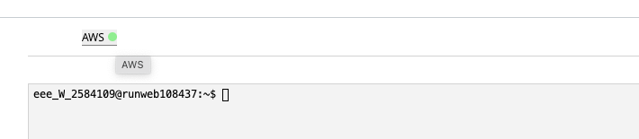
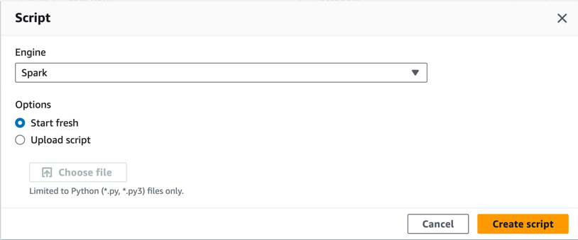
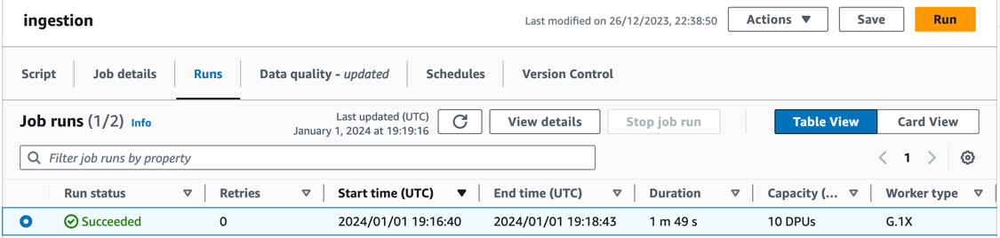
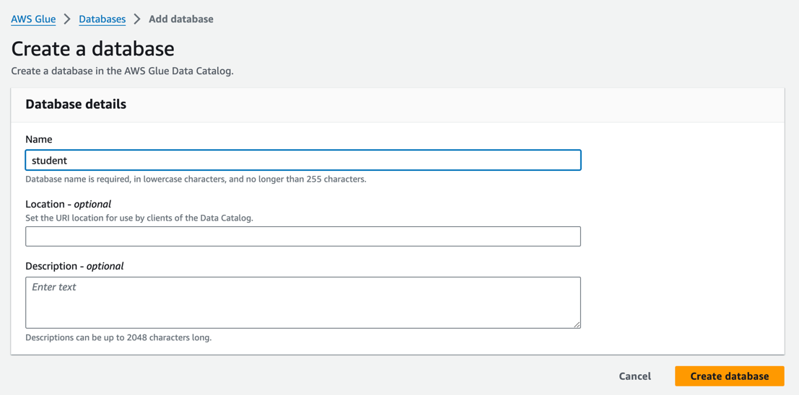
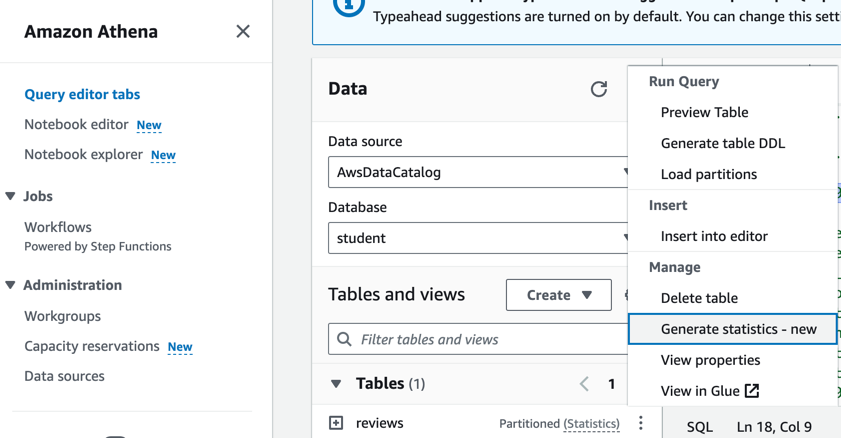
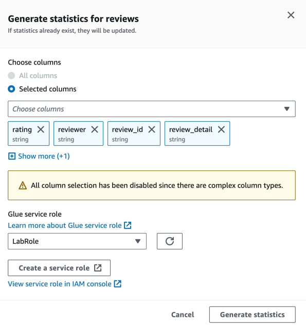
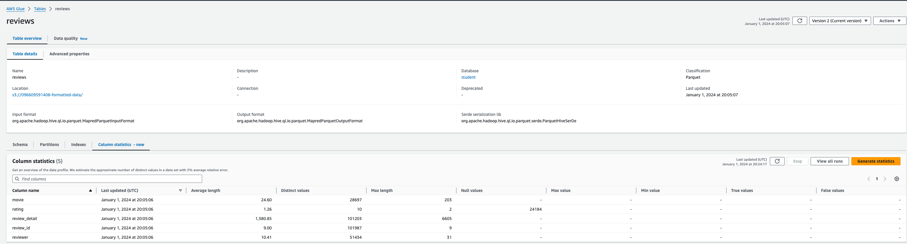

## Data Ingestion

### Prepare student environment

1. Login to AWS Academy
2. The invitation should point to `AWS Academy Learner Lab` course
3. Find the module `Launch AWS Academy Learner Lab`
4. Click on `Start Lab`. 

   

5. Start AWS Console when the dot will change the colour to green

   
   ```
   The AWS session is active for 3 hours. Feel free to run "Start Lab" again before session expire time is reached to avoid starting the session again.
   ``` 

### Architecture to be implemented

```puml
@startuml
!pragma layout smetana
!theme aws-orange

!define AWSPuml https://raw.githubusercontent.com/awslabs/aws-icons-for-plantuml/v17.0/dist

!include AWSPuml/AWSCommon.puml
!include AWSPuml/AWSC4Integration.puml
!include AWSPuml/AWSSimplified.puml
!include AWSPuml/AWSRaw.puml
!include AWSPuml/ApplicationIntegration/all.puml
!include AWSPuml/Compute/all.puml
!include AWSPuml/Containers/all.puml
!include AWSPuml/Database/all.puml
!include AWSPuml/General/all.puml
!include AWSPuml/Analytics/all.puml
!include AWSPuml/Storage/all.puml

SimpleStorageService(LandingZone, "Raw data", " ") #White
Glue(ETL, "PySpark App", " ") #White
SimpleStorageService(FormattedData, "Formatted data", " ") #White
GlueDataCatalog(DataCatalog, "AWS Glue catalog", " ") #White
Athena(Athena, "Athena", " ") #White

LandingZone -> ETL: read raw data
ETL-> FormattedData: store as parquet
FormattedData -> DataCatalog: crate database
DataCatalog <-> Athena: create table,\n read partitions

@enduml
```

### Data ingestion

1. Download `sample.json` [IMDb Review Dataset](https://www.kaggle.com/datasets/ebiswas/imdb-review-dataset/data) which are publicly available on Kaggle platform.

   ```
   The dataset contains 5.5M movie reviews. The dataset is divided into multiple parts. Please follow the instructions starting with `sample.json, then you can try with full dataset.
   ```

2. Create S3 bucket from AWS console.
   ```
   Run the script with `CloudShell` or create bucket manually from `Amazon S3/Buckets` service
   ```

   ```shell
   aws s3api create-bucket --bucket ${ACCOUNT_ID}-landing-zone --region us-east-1
   ```

3. Upload the raw data (sample.json) to the bucket.

   

### Conversion from json to parquet 

1. Create S3 bucket from AWS console for data converted to `Parquet`
   ```
   Run the script with `CloudShell` or create bucket manually from `Amazon S3/Buckets` service
   ```
   
   ```shell
   aws s3api create-bucket --bucket ${ACCOUNT_ID}-formatted-data --region us-east-1
   ```

2. Open `ETL Jobs/Notebooks` from `AWS Glue` service
3. Create new script

   * Engine: Spark
   * Options: Start fresh

   

3. Implement ETL process

* create PySpark context
* read the `json` files from `landing-zone` bucket on `S3` to `DataFrame` object
* store the data in `parquet` format using `review_date` as partitining key

   ```python
   # Example implementation
   import sys
   from awsglue.transforms import *
   from awsglue.utils import getResolvedOptions
   from pyspark.context import SparkContext
   from awsglue.context import GlueContext
   from awsglue.dynamicframe import DynamicFrame
   from awsglue.job import Job
   
   args = getResolvedOptions(sys.argv, ["JOB_NAME"])
   sc = SparkContext()
   glueContext = GlueContext(sc)
   spark = glueContext.spark_session
   job = Job(glueContext)
   job.init(args["JOB_NAME"], args)
   
   dataFrame = spark.read.json("s3://637765332182-landing-zone/sample.json")
   
   dynamicFrame = DynamicFrame.fromDF(dataFrame, glueContext, "")
   
   
   glueContext.write_dynamic_frame.from_options(
       frame=dynamicFrame,
       connection_type='s3',
       connection_options={
           'path': "s3://637765332182-formatted-data", "partitionKeys": ["review_date"]
       },
       format='parquet',
   )
   
   job.commit()
   ```

4. Run script

   ```
   Check the `Runs` tab and verify if the process is in the `Running` status. Eventually the target status should be `Succeeded` 
   ```

   

### Evaluate the data quality

1. Open `Data Catalog/Tables` from `AWS Glue` 
2. Create new database `student`

   

3. Open `Query editor tabs` from `Athena`
4. Create new table based on the data stored in the S3 bucket

   * Data source: AwsDataCatalog
   * Database: student
   * Skrypt do utworzenia tabeli:
   ```sql
     CREATE EXTERNAL TABLE `reviews`(
     `helpful` array<string>,
     `movie` string,
     `rating` string,
     `review_detail` string,
     `review_id` string,
     `review_summary` string,
     `reviewer` string,
     `spoiler_tag` bigint)
     PARTITIONED BY (review_date string)
     ROW FORMAT SERDE
     'org.apache.hadoop.hive.ql.io.parquet.serde.ParquetHiveSerDe'
     STORED AS INPUTFORMAT
     'org.apache.hadoop.hive.ql.io.parquet.MapredParquetInputFormat'
     OUTPUTFORMAT
     'org.apache.hadoop.hive.ql.io.parquet.MapredParquetOutputFormat'
     LOCATION
     's3://${ACCOUNT_ID}-formatted-data/'
     TBLPROPERTIES (
     'CrawlerSchemaDeserializerVersion'='1.0',
     'CrawlerSchemaSerializerVersion'='1.0',
     'UPDATED_BY_CRAWLER'='review_crawler',
     'averageRecordSize'='1459',
     'classification'='parquet',
     'compressionType'='none',
     'objectCount'='1',
     'recordCount'='100000',
     'sizeKey'='94807077',
     'typeOfData'='file')
   ```
5. Import all partitions
   * Run script:
   ```sql
    MSCK REPAIR TABLE `reviews`;
   ```
   
6. Check the data quality
   * Generate column statistics for `reviews` table
   
   
   
   * Choose the subset of columns
   
   
   
   * Open `Data Catalog/Databases/Tables` tab from `AWS Glue` service to display column statistics
   
   

### References