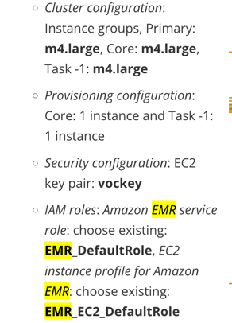
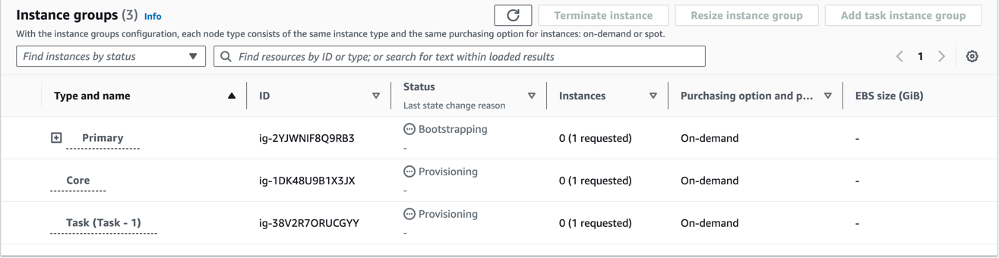
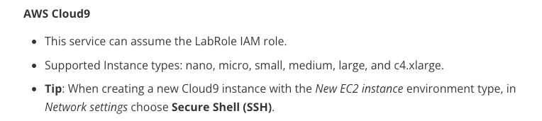
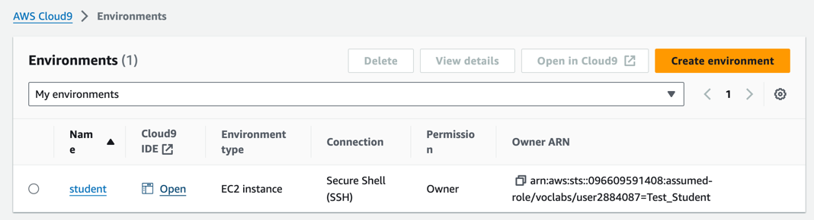
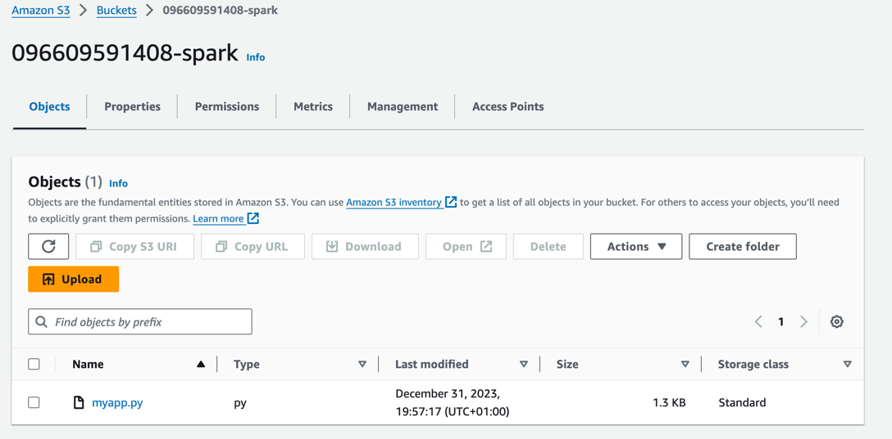
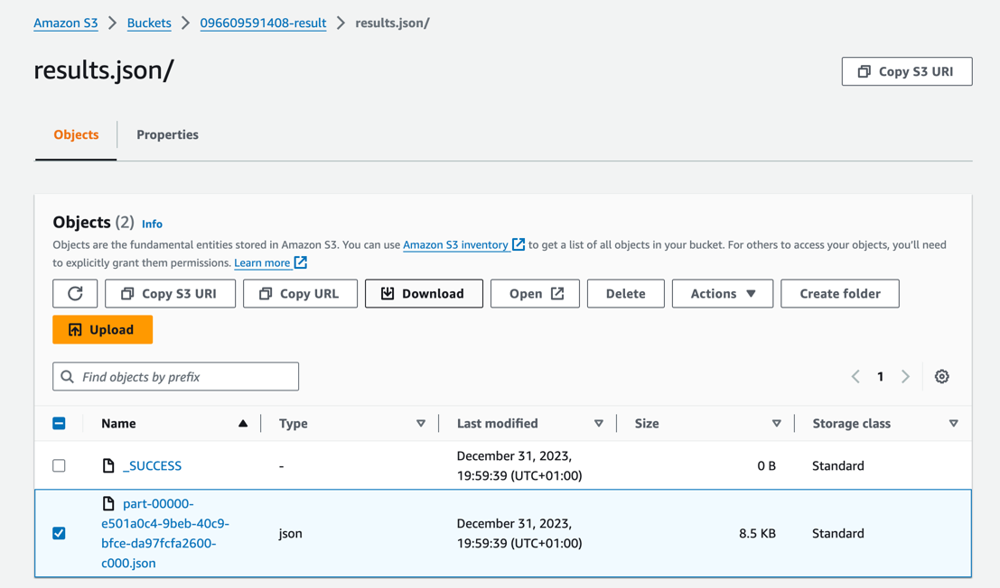

## Top rated movies

### Architecture to be implemented

```puml
@startuml
!pragma layout smetana
!theme aws-orange

!define AWSPuml https://raw.githubusercontent.com/awslabs/aws-icons-for-plantuml/v17.0/dist

!include AWSPuml/AWSCommon.puml
!include AWSPuml/AWSC4Integration.puml
!include AWSPuml/AWSSimplified.puml
!include AWSPuml/AWSRaw.puml
!include AWSPuml/ApplicationIntegration/all.puml
!include AWSPuml/Compute/all.puml
!include AWSPuml/Containers/all.puml
!include AWSPuml/Database/all.puml
!include AWSPuml/General/all.puml
!include AWSPuml/Analytics/all.puml
!include AWSPuml/Storage/all.puml

SimpleStorageService(FormattedData, "Formatted data", " ") #White
SimpleStorageService(Output, "Top movies", " ") #White
GlueDataCatalog(DataCatalog, "AWS Glue catalog", " ") #White
Athena(Athena, "Athena", " ") #White

EMRCluster(EMRCluster, "EMR cluster", " ") #White
Batch(BatchJob, "PySpark App", " ") #White

FormattedData -> DataCatalog: data catalog
DataCatalog -> Athena: data analytics with SQL

Athena -[hidden]-> EMRCluster

BatchJob -u-> EMRCluster: run ETL process

FormattedData -> BatchJob: read data
BatchJob -> BatchJob: transform data
BatchJob --> Output: store data

@enduml
```


### Data analytics with Amazon Athena

1. Create S3 bucket from AWS console to store the results of SQL queries
   ```
   Run the script with `CloudShell` or create bucket manually from `Amazon S3/Buckets` service
   ```

   ```shell
   aws s3api create-bucket --bucket ${ACCOUNT_ID}-query-result --region us-east-1
   ```

2. Open `Query editor tabs/Settings` tab from `Athena` service and click `Manage` action

   

3. Open `Query editor tabs` from `Athena` service and run the following query

    * Display first 10 reviews
    ```sql
    SELECT * FROM "student"."reviews" limit 10;
    ```
    * Generate rank of top rated movies for each year
    ```sql
    SELECT movie, avg(cast(rating as double)) as avg_rating, regexp_extract(movie, '\(\d+\)') as movie_year FROM "student"."reviews"  group by regexp_extract(movie, '\(\d+\)'), movie order by movie_year desc, avg_rating desc;
    ```

## Create EMR cluster

1. Open `EMR on EC2/Clusters` from `EMR` service and create new cluster

   * Amazon EMR release: emr-6.15.0
   * Application bundle: Spark interactive (default)
   * Be aware of the restrictions of the student accounts in the `Learner Lab`
   
   

2. `EMR on EC2/Clusters` from `EMR` service and check the cluster status

   * Choose the cluster id
   * Open `Instances(hardware)` tab and check the status of the cluster infrastructure
   
``   

## Start Cloud9 Studio

1. Open `My environments` tab from `Cloud9` service and create new environment

   * configure according to `Learner Lab` recommendations:
   
   
   
2. Open `Cloud9 IDE` environment

   


### Implement ETL process to generate rank of top rated movies for each year

```
The goal is to create the ETL process to generate rank of top rated movies for each year sorted by the year
```

1. Create new file `myapp.py` in `Cloud9 IDE`

2. Implement the PySpark application

   ```python
   from pyspark.sql import SparkSession
   from pyspark.sql.functions import regexp_extract, desc, avg, row_number, col, count
   from pyspark.sql.window import Window
   
   def main():
       with SparkSession.builder.appName("MyApp").getOrCreate() as spark:
           df = spark.read.parquet("s3://096609591408-formatted-data")
   
           # preprocessing
           df = df.filter(df.rating.isNotNull())
   
           movies_with_avg_rating = df.groupBy(df.movie).agg(avg(df.rating).alias("avg_rating"), count(df.movie).alias("num_of_reviews")).sort(
               desc("avg_rating"))
   
           movies_with_avg_rating = movies_with_avg_rating.filter(movies_with_avg_rating.num_of_reviews > 5)
           movies_with_avg_rating = movies_with_avg_rating.withColumn("movie_year", regexp_extract(movies_with_avg_rating.movie, "\(\d+\)", 0))
   
           movie_ranking_by_year_window = Window.partitionBy("movie_year").orderBy(col("avg_rating").desc())
           top_movies_for_each_year = movies_with_avg_rating.withColumn("row", row_number().over(movie_ranking_by_year_window)).filter(
               col("row") == 1).drop("row").orderBy(col("movie_year").desc())
   
           top_movies_for_each_year.limit(150).coalesce(1).write.json("s3://096609591408-result/results.json", mode='Overwrite')
   
   
   if __name__ == "__main__":
       main()
   ```

3. Create S3 bucket from AWS console to store the results of the ETL process
   ```
   Run the script with `CloudShell` or create bucket manually from `Amazon S3/Buckets` service
   ```

   ```shell
   aws s3api create-bucket --bucket ${ACCOUNT_ID}-result --region us-east-1
   ```
4. Create S3 bucket from AWS console to store the application script
   ```
   Run the script with `CloudShell` or create bucket manually from `Amazon S3/Buckets` service
   ```

   ```shell
   aws s3api create-bucket --bucket ${ACCOUNT_ID}-spark --region us-east-1
   ```  
5. Download `myapp.py` to local machine and then upload to the dedicated bucket

   

6. Run the ETL process

   * Run script from Cloud9 console:
   ```
   aws emr add-steps --cluster-id ${CLUSTER_ID} --steps Type=Spark,Name="Spark job",ActionOnFailure=CONTINUE,Args=[--deploy-mode,cluster,--master,yarn,s3://${ACCOUNT_ID}-spark/myapp.py]
   ```

   * Open `EMR on EC2/Clusters/Steps` from `EMR` service and check the ETL execution status
   
      

   * Download the results and verify if the rank of top rated movies is correctly generated

   

### References

[Install additional dependcies for EMR cluster](https://docs.aws.amazon.com/emr/latest/ManagementGuide/emr-plan-bootstrap.html)
