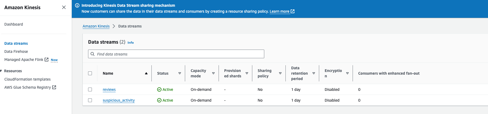
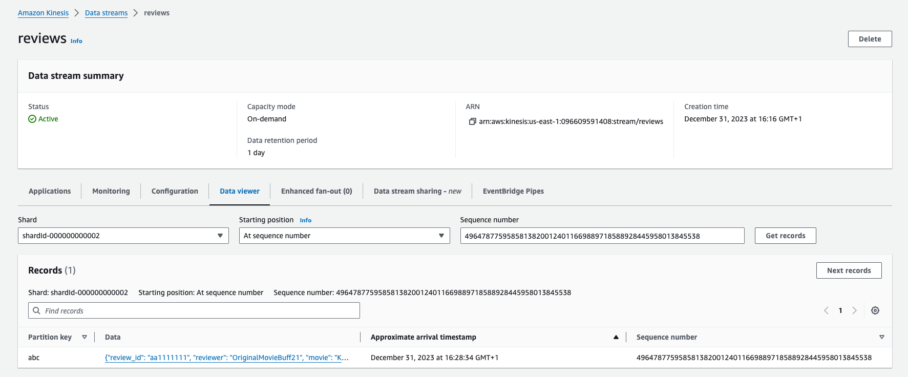
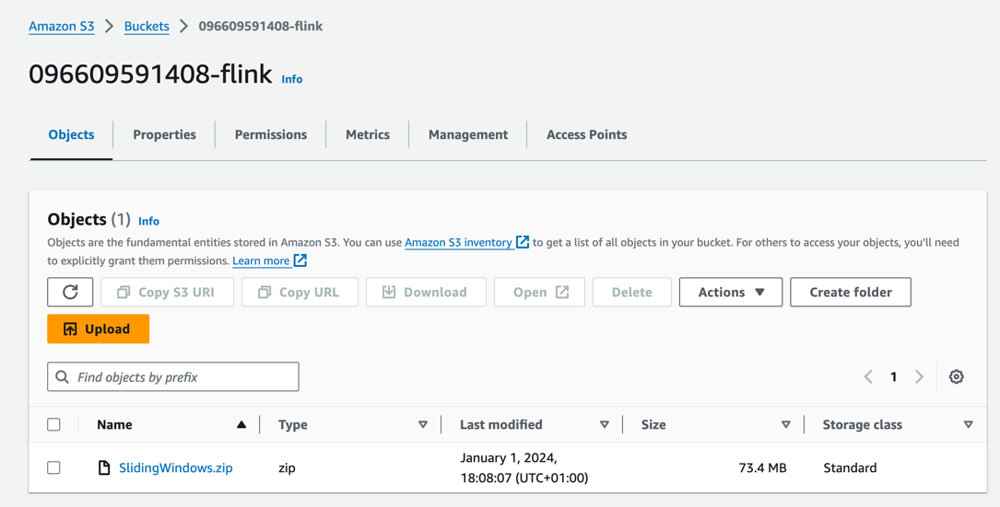
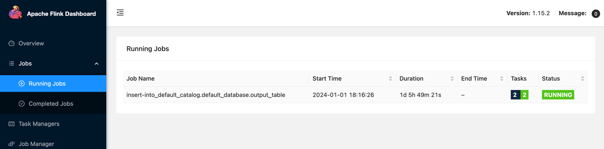

## Real time anomaly detection

### Architecture to be implemented

```puml
@startuml
!pragma layout smetana
!theme aws-orange

!define AWSPuml https://raw.githubusercontent.com/awslabs/aws-icons-for-plantuml/v17.0/dist

!include AWSPuml/AWSCommon.puml
!include AWSPuml/AWSC4Integration.puml
!include AWSPuml/AWSSimplified.puml
!include AWSPuml/AWSRaw.puml
!include AWSPuml/ApplicationIntegration/all.puml
!include AWSPuml/Compute/all.puml
!include AWSPuml/Containers/all.puml
!include AWSPuml/Database/all.puml
!include AWSPuml/General/all.puml
!include AWSPuml/Analytics/all.puml
!include AWSPuml/Storage/all.puml

SimpleStorageService(LandingZone, "Raw data", " ") #White
Lambda(Producer, "Event producer", " ") #White
KinesisDataStreams(InputStream, "Reviews stream", " ") #White
ManagedServiceforApacheFlink(StreamProcessor, "Real time processing", " ") #White
KinesisDataStreams(OutputStream, "stream of suspicious reviewers", " ") #White

LandingZone --> Producer: read raw data
Producer --> InputStream: generate event\n for each input review
InputStream --> StreamProcessor: check for suspicious activity
StreamProcessor --> OutputStream: generate event\n on the suspicious activity stream

@enduml
```

### Setting up infrastructure for stream processing

1. Create `Kinesis` streams

   * Open `Data streams` from `Kinesis` service and choose `Create data stream` action
   * Create two streams: `reviews` and `suspicious_activity`
   
   

### Implementing event producer

1. Open `Functions` tab from `AWS Lambda` service and choose `Create function` action
   * Option: Author from scratch
   * Function name: reviewProducer
   * Runtime: Python 3.12
   * Architecture: x86_64
2. Open `Functions` tab from `AWS Lambda` and choose `reviewProducer` function
   * Change the configuration in `Configuration` tab
     * Memory 512 MB
     * Timeout 5min
   * Open`Code` tab and replace the source code with the script below:

    ```python
    import boto3
    import json
    import datetime
    import logging
    
    
    logger = logging.getLogger()
    logger.setLevel("INFO")
    
    stream_name = 'reviews'
    bucket =  '096609591408-landing-zone'
    key = 'sample.json'
    
    s3_client = boto3.resource('s3')
    kinesis_client = boto3.client('kinesis', region_name='us-east-1')
    
    
    
    def lambda_handler(event, context):
        logger.info("Lambda invoked")
    
        obj = s3_client.Object(bucket, key)
        data = obj.get()['Body'].read().decode('utf-8')
        json_data = json.loads(data)
        for record in json_data:
            review_id = record["review_id"]
            reviewer = record["reviewer"]
            movie = record["movie"]
            rating = record["rating"]
            review_summary = record["review_summary"]
            review_date = record["review_date"]
            spoiler_tag = record["spoiler_tag"]
            review_detail = record["review_detail"]
            spoiler_tag = record["spoiler_tag"]
            helpful = record["helpful"]
    
            put_to_stream(review_id, reviewer, movie, rating, review_summary, review_date, spoiler_tag, review_detail, helpful)
        logger.info("Lambda finished")
    
    
    def put_to_stream(review_id, reviewer, movie, rating, review_summary, review_date, spoiler_tag, review_detail, helpful):
        payload = {
            "review_id": review_id,
            "reviewer": reviewer,
            "movie": movie,
            "rating": rating,
            "review_summary": review_summary,
            "review_date": review_date,
            "spoiler_tag": spoiler_tag,
            "review_detail": review_detail,
            "helpful": helpful,
            "event_time": datetime.datetime.now().isoformat()
        }
    
        logger.info(payload)
    
        response = kinesis_client.put_record(
            StreamName=stream_name,
            Data=json.dumps(payload),
            PartitionKey=review_id)
    
        logger.info(response)
    ```
   * Create new test message and run test
   
   

   * Open `Data streams/reviews` from `Kinesis` service and open `Data viewer` tab. Check if new events are visible

   

   
### Implement anomaly detection app

1. Download repository to local machine [github](https://github.com/dwarszawski/amazon-managed-service-for-apache-flink-examples)
2. Create S3 bucket to store the application as zip file
```
   Run the script with `CloudShell` or create bucket manually from `Amazon S3/Buckets` service
```

```shell
aws s3api create-bucket --bucket ${ACCOUNT_ID}-flink --region us-east-1
```
3. Create the zip file based on `python/SlidingWindows` directory

```shell
zip -r  SlidingWindows.zip SlidingWindows
```
4. Upload the zip archive to S3 bucket created in the step 2.



5. Open `Apache Flink applications` from `Managed Apache Flink` service and open `Create streaming application` form
   * Create from scratch
   * Apache Flink version: 1.15
   * Application name: student
   * Templates: Development
6. Open `Apache Flink applications` from `Managed Apache Flink` on choose the newly created application
   * Configure application with `Configure` action
     * Amazon S3 bucket: s3://${ACCOUNT_ID}-flink
     * Path to S3 object: SlidingWindows.zip
     * Access to application resources: Choose from IAM roles that Managed Service for Apache Flink can assume
     * Service role: LabRole
     * Snapshots: Update without snapshot
     * Runtime properties:
       
       | Group ID                            | Key                 | Value                                                     |
       |-------------------------------------|---------------------|-----------------------------------------------------------|
       | kinesis.analytics.flink.run.options | jarfile             | SlidingWindows/lib/flink-sql-connector-kinesis-1.15.2.jar |
       | kinesis.analytics.flink.run.options | python              | SlidingWindows/sliding-windows.py                         |
       | consumer.config.0                   | aws.region          | us-east-1                                                 |
       | consumer.config.0                   | input.stream.name   | reviews                                                   |
       | consumer.config.0                   | scan.stream.initpos | LATEST                                                    |
       | producer.config.0                   | aws.region          | us-east-1                                                 |
       | producer.config.0                   | output.stream.name  | suspicious_activity                                       |
       | producer.config.0                   | shard.count         | 1                                                         |
7. Run application
   * The status of application should changed to `Running`
8. Generate events to `reviews` stream
   * Open `Functions` from `AWS Lambda` and choose `reviewProducer` function
   * Open `Code` tab and run the function with `Test` button
9. Open `Apache Flink applications` tab from `Managed Apache Flink` service, then choose `student` app and open `Open Apache Flink Dashboard` view
   * Open 'Jobs/Running Jobs' tab and check if the application is in the `Running` state
   
   
10. Open `Data streams/suspicious_activity` from `Kinesis` service and choose `Data viewer` view
    *  Check if the events are visible

    

### References
